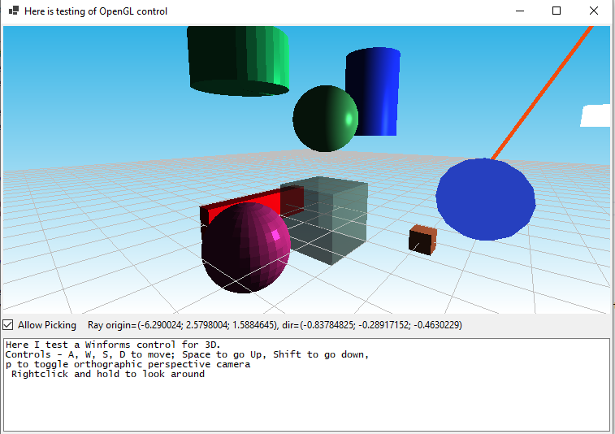

### Opentk (Opengl) control for C# WinForms, for scientific and engineering visualisation

I think that Opentk (Opengl) control for WinForms may be useful, because WPF 3D does not work well on some computers (with Intel built-in videochips), and also Winforms does not have highlevel control for 3D graphics. It's OpenGL and it's too complicated for me to implement singlehanded. But it's my dream. One day it may come true. Desired functionality is similar to WPF 3D or Wolf Toolkit (WPF): 

- simple 3D scene setup and intuitive manipulation of objects on camera (OpenGL does not have definition of object by design, it operates with matrices and arrays of coordinates). 
- Camera class. Intuitive setup for camera with handy methods like Move camera, turn camera around, zoom-pan camera, fit all objects on scene into view, without thinking about matrix transformations. Orthogonal and perspective camera setting. 
- grouping of objects on scene should be implemented too, so when one object moves, parent objects should move with it.
- Math and transforms: rotate object around specific point, translate object to distance, mirror object over arbitrary mirroring plane. OpenTK already contains matrix calculations, those methods are to extend
- Predefined objects (cylinder, cube, sphere) and ability to setup my own object using vertices/indices/normals 
- Screen-space lines with ability to set up their thickness 
- Predefined Phong shaders and materials (uhh shaders), and also with transparency shaders too, with appropriate z-layering, no raytracing and physical lighting needed, it's for engineering. Just simple lighting. Ability to set specularity and color. No shadows needed. Also, ability to set up ambient lighting. Gradient background of scene is ok 
- Picking items on scene with mouse 
- Screen-space cube (like in Inventor or Sketchup or Maya) to quickly set desired view of camera, or axis lines (like in Blender 3D)

